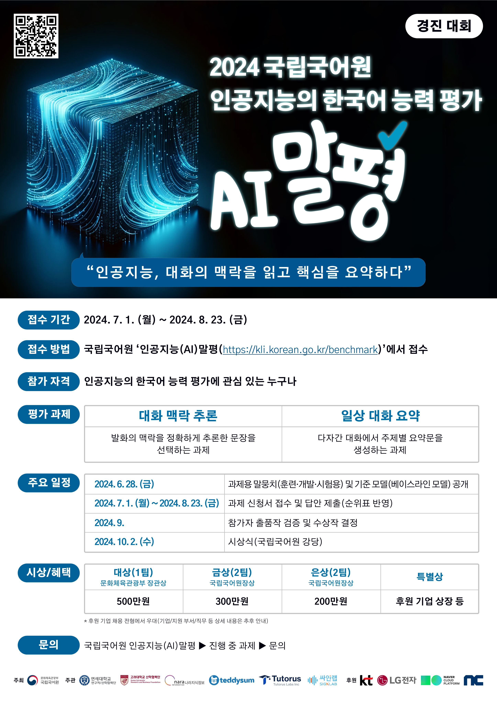

# Korean_CCI_2024

## 대회 개요

#### 2023 국립국어원 인공지능의 한국어 능력 평가 대화 맥락 추론 부문


<br>

## Contents
- [모델 사용법](#모델-사용법)
- [대회 개요](#대회-개요)
- [데이터설명](#데이터-설명)
- [데이터 전처리 및 데이터 분석](#데이터-전처리-및-데이터-분석)
- [모델 개요](#모델-개요)
- [평가 결과 및 성능이 오르지 않았던 접근법들](#평가-결과-및-성능이-오르지-않았던-접근법들)

<br>

## 모델 사용법

folder structure은 다음과 같이 설정해주세요. (data, output 확인)

```plaintext
Korean_CCI_2024/
├── data/
│   ├── dev.json
│   ├── train.json
│   └── test.json
├── output/
│   ├── fold0/
│   │   ├── checkpoint-2040/
│   │   │   ├── ...
│   │   │   ├── ...
│   │   │   └── ...
|   ...
|   ...
|   ...
│   ├── fold10/
│   │   ├── checkpoint-1890/
│   │   │   ├── ...
│   │   │   ├── ...
│   │   │   └── ...
├── run/
│   ├── ensemble.py
│   ├── trainer.py
│   ├── train.py
│   └── test.py
├── src/
│   ├── data.py
│   └── utils.py
├── .gitignore
└── README.md
```

<br>

가중치 파일 다운로드 링크입니다. 해당 폴더 안에 있는 폴더들을 전부 output 폴더 안에 넣어주세요.
https://drive.google.com/drive/folders/1DNsEMTdCbUm8r_5ZIqaMlEgmhqyqVvIN?usp=drive_link

<hr>

추가로 data같은 경우는 모두의 말뭉치 사이트에서 다운로드받으셔야 합니다.

<br>

실행방법은 다음과 같습니다.
train.py와 test.py 2번째 줄에서 sys.append부분이 있는데 이 부분을 해당 명령어를 실행하는 위치의 절대경로로 설정해주세요.     
(지웠을 때 오류가 나지 않는다면 상관없음)
```plaintext
python src/train.py\
    --model_id kihoonlee/STOCK_SOLAR-10.7B\
    --tokenizer kihoonlee/STOCK_SOLAR-10.7B\
    --fold_mode False\
    --fold_num 10\
    --fold_idx 0\
    --batch_size 1\
    --gradient_accumulation_steps 4\
    --warmup_steps=-2\
    --lr 0.00005\
    --epoch 10\
    --weight_decay 0.1\
    --seed 42\
    --tokenizer_parallel True\
    --change_name True\
    --quant_allow False\
    --quant_4bit False\
    --quant_4bit_double False\
    --quant_4bit_compute_dtype bfloat16\
    --quant_8bit False\
    --model_dtype bfloat16\
    --lora_rank 16\
    --lora_alpha 32\
    --lora_dropout 0\
    --lora_bias none\
    --train_path ./data/train.json\
    --dev_path ./data/dev.json\
    --save_dir output/fold0
```
필수로 바꾸셔야 할 파라미터는 `save_dir`입니다.

<br>

inference 방법은 다음과 같습니다.
```plaintext
python src/train.py\
   --output output/fold0.json\
    --model_id kihoonlee/STOCK_SOLAR-10.7B\
    --tokenizer kihoonlee/STOCK_SOLAR-10.7B\
    --device cuda\
    --device_number 1\
    --peft_model_dir ./test_git/checkpoint-2040\
    --test_dir data/test.json
```
필수로 바꾸셔야 할 파라미터는 `peft_model_dir`, `device_number`, `output`입니다.

<br>

앙상블 방법은 다음과 같습니다.
```plaintext
python src/ensemble.py\
      --dir output\
      --d0 fold0.json\
      --d1 fold1.json\
      --d2 fold2.json\
      --d3 fold3.json\
      --d4 fold4.json\
      --d5 fold5.json\
      --d6 fold6.json\
      --d7 fold7.json\
      --d8 fold8.json\
      --d9 fold9.json\
      --d10 fold10.json\
      --save_dir ensemble.json
```
파라미터를 전부 바꾸셔야 합니다.

<br>

재현 방법은 다음과 같습니다.
```
./train.sh
./test.sh
```
(필자 환경이 window라서 잘 작동되는지는 모르겠음..)

재현 방법의 과정은 다음과 같습니다.
1. 10fold를 학습 + 기존 train, dev로 학습(fold_mode로 조정하시면 됩니다.)
2. 11개의 모델 각각을 inference하고 나온 json파일들을 ensemble.py를 통해 hard voting ensemble하면 됩니다.

<br>

## 데이터 설명

데이터 세트는 train, develop, test data로 분할하여 제공되었고 자료 수는 다음과 같다.

||train|develop|test|
|:----:|:----:|:----:|:----:|
|자료 수|758|151|605|

<br>

데이터의 구조는 다음과 같다
```plaintext
┌id
│input
├── conversation
│   ├── speaker
│   ├── utterance
│   └── utterance_id
├── reference_id
├── category
├── inference_1
├── inference_2
└── inference_3
└output
```
<br>

category는 총 5가지로 다음과 같다.
|유형|정의|
|:----:|:----:|
|원인(cause)|대상 발화의 사건을 유발하는 사건|
|후행 사건(subsequent event)|대상 발화 이후에 일어날 수 있는 사건|
|전제 조건(prerequisite)|대상 발화의 사건을 가능하게 하는 상태 혹은 사건|
|내적 동기(motivation)|대상 발화를 일으키는 '화자'의 감정이나 기본 욕구|
|감정 반응(emotional reaction)|대상 발화 사건에 대해 '청자'가 보일 수 있는 감정 반응|

<br>

대화문, 대상 발화, 그리고 추론문의 유형을 종합적으로 고려하여 주어진 세 가지 추론문 후보 중 대상 발화의 추론 유형에 가장 적합한 하나를 선택하는 모델을 만들어야 한다.

<br>

## 데이터 전처리 및 데이터 분석

Chat template는 다음과 같다.
```plaintext



{{'### System:\n' + message['content']+'\n\n'}}


{{'### User:\n' + message['content']+'\n\n'}}

{{'### Assistant:\n'  + message['content']}}


{{ '### Assistant:\n' }}

```

<br>

System prompt는 다음과 같다.
```plaintext
You are an AI assistant that helps users analyze conversations and solve related problems.
Please read the conversation carefully and select the most appropriate answer to the question based on the given options.
```

<br>

다음은 User prompt의 예시이다.
```plaintext
[Conversation]
화자1: 안녕하세요! ㅎㅎ
화자2: 안녕하세요!
화자2: 동호회활동하세요?
화자1: 저는 차 마시는 거 좋아해서 차 좋아하는 사람들이랑 가끔 다회 참석해요
화자1: name2님은 동호회활동 참여하는 거 있으신가요?
화자2: 오오
화자2: 아니요ㅋㅋㅋ저는 없어요
화자2: 새로운 사람 만나는 걸 즐기지는 않아서 아직 시도를 못 해봤어요 동호회!
화자1: 아하ㅎㅎ  저는 직업상 만나는 사람들이 한정적이어서 동호회 활동을 하니까 다양한 사람을 만나게 되어 좋더라고요
화자1: 저도 굉장히 내향적인 편인데 동호회 안에서 친해진 사람들하고만 만나고 있어요
화자2: 이상하게 동호회는 목적이 다르다는 편견이 좀 있어서 망설여지더라고요!
화자2: 물론 다 그런 게 아닌데!
화자1: 아 무슨 말씀이신지 너무 알 것 같아요
화자1: 불순한 목적으로 동호회 참석하는 사람들 때문에 좀 이미지가 그렇긴 하죠
화자1: 특히 남자..들.. 이런 말 해도 되나요 ㅋㅋㅋ
화자2: 으으 맞아요 맞아
화자2: 안 좋은 얘기도 사실 많이 들어서...
화자1: 제가 참석하는 차 동호회는 20대 여자가 대부분이라 더 편하게 만날 수 있는 것 같아요ㅠ
화자1: 여성 동호회 쪽으로 알아보시면 좀 걱정이 덜하지 않을까요
화자2: 오! 그런 방법이 있겠네요
화자2: 그리고 어떤 분이 그러셨는데
화자2: 약간 돈이 드는 동호회? 는 오히려 그런 사람이 적대요ㅋㅋㅋㅋㅋㅋ
화자1: 돈이 드는 동호회 ㅋㅋㅋㅋㅋ  차는 돈이 좀 들어서 그런 걸까요
화자2: 네! 그럴지도 몰라요
화자2: 동호회는 인터넷에서 검색해서 들어가는 건가요?
화자1: 저는 트위터로 시작해서 마음 맞는 사람들이랑 같이 만나고 있어요
화자2: 오호 트위터!
화자2: 그런 방법도 있네요 정말
화자2: 트위터하면 아무래도 관심사가 비슷한 사람을 만나게 되니까요
화자1: 맞아요 맞아요

[Question]
위 대화의 후행사건으로 올바른 지문은?

[Option]
A. 화자2는 미혼 남녀 대상의 동호회를 알아볼 것이다. 
B. 화자2는 가입 가능한 여성 동호회를 알아볼 것이다.
C. 화자2는 연애를 할 목적으로 동호회를 알아볼 것이다.
```

<br>

train, develop data의 utterance를 살펴본 결과 대화에서 '화자1', '화자2'같이 표기되는 것이 아닌 'name1', 'name2'와 같이 표기되있었음.
모델이 혼란을 줄 수 있다고 판단해 'name'을 '화자'로 변환시켜 주었다.

<br>

train, develop의 inference1, inference2, inference3의 개수는 다음과 같다.
||inference1|inference2|inference3|
|:----:|:----:|:----:|:----:|
|train|260|236|262|
|develop|48|50|53|

학습을 시킬 때 inference의 위치를 다르게 만들었다.

<br>

## 모델 개요

모델은 `kihoonlee/STOCK_SOLAR-10.7B`를 사용하였다.
이 모델을 사용한 이유는 크게 3가지 이다.
1. Open ko llm leaderboard 2등 모델
2. 같은 파라미터일 때 llama3 8B -> gemma2 9B -> solar10.7B 순으로 성능이 좋았다.(파라미터 수가 많아질수록 성능이 더 좋아질 것이라고 예상)
3. RTX 4090 24GB내에서 8bit quantization했을 때 inference가 가능함.

<br>

<br>
모델이 학습하는 과정은 다음과 같다.

1. 별도의 Quantization은 진행하지 않는다.(Qlora + SFT 보다 lora + SFT를 통해 최대 성능을 낸 후 inference할 때 Quantization하면 성능이 더 좋았음.
2. Prompt를 Solar10.7B model에 넣는다.
3. lm_head에서 나온 Output에서 'A', 'B', 'C'에 해당하는 위치의 logit만 가져온다.
4. label과 logit의 loss를 CrossEntropyLoss를 통해 구한다.
5. adamw_hf를 통해 lora layers의 파라미터를 학습시킨다.

<br>

모델이 추론하는 과정은 다음과 같다.
1. Solar 10.7B 모델을 8bit quantization한다.
2. Prompt를 Solar10.7B model에 넣는다.
3. lm_head에서 나온 Output에서 'A', 'B', 'C'에 해당하는 위치의 logit만 가져온다.
4. softmax를 통해서 가장 확률이 높은 답을 선택.
5. inference의 순서에 따라 오차가 있는 것을 발견하고 self-consistency prompt기법을 적용
   (inference의 위치를 바꿔서 문제 하나당 총 6번의 추론을 진행)
6. 같은 모델에 대해 hard voting ensemble을 진행함.
7. 10-fold를 통해 나온 모델 + 기존 train, dev로 나뉜 데이터로 학습된 모델에서 나온 결과를 hard voting ensemble을 진행함.
   (이렇게 한 이유는 전체 파라미터를 학습 시킨게 아니라 bias는 작지만 모델의 예측 변동성(variance)가 크다는 것을 발견하여 앙상블하면 성능이 올라갈 것이라고 예상)

<br>

## 평가 결과 및 성능이 오르지 않았던 접근법들

fold별 test data의 최소 성능은 95 이상이었다.
하지만 앞에서 말했듯이 bias는 낮지만 variance가 높은 문제가 있었다.
variance가 높은 문제를 해결하기 위해 11개의 모델을 ensemble했고 최종적으로 test data의 성능이 97로 올랐다.

모델 개선 방안
1. 더 많은 모델들을 학습해 앙상블
2. 10.7B보다 파라미터의 수가 더 많은 model을 선택
3. lora 대신 전체 모델을 full fine-tuning
4. Prompt 개선
